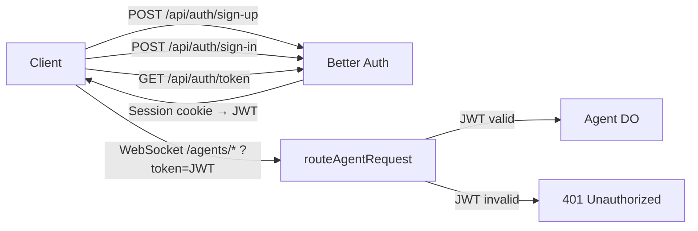

import { TypeScriptExample, WranglerConfig } from "~/components";

[Better Auth](https://www.better-auth.com/) is a full-stack authentication library that provides sign-up, sign-in, email/password, session management, and JWT issuance. When combined with the Agents SDK, you get a complete user management system running entirely on Cloudflare, using [D1](/d1/) as the user database.

This approach is ideal when:

- You need user registration and sign-in (not just token validation).
- You want to own the entire auth stack without a third-party auth service.
- You need session management, password hashing, and JWT issuance in one package.
- You are building a product where users create accounts and interact with personalized Agent instances.

You can view the full example code on [GitHub](https://github.com/cloudflare/agents/tree/main/examples/auth-agent).

## How it works

The architecture splits requests across three paths in your Worker's `fetch` handler:

| Path          | Handler             | Purpose                                                  |
| ------------- | ------------------- | -------------------------------------------------------- |
| `/api/auth/*` | Better Auth         | Sign-up, sign-in, session management, JWT issuance, JWKS |
| `/agents/*`   | `routeAgentRequest` | Agent routes, protected by JWT validation in auth hooks  |
| `/*`          | Your frontend       | SPA or static assets                                     |



The authentication flow is:

1. User signs up or signs in via Better Auth. A session cookie is set automatically.
2. Client calls the Better Auth token endpoint to get a short-lived JWT (authenticated via the session cookie).
3. The JWT is stored client-side and passed as `?token=` on WebSocket connections or as a `Bearer` token on HTTP requests.
4. The `onBeforeConnect` / `onBeforeRequest` hooks on the server verify the JWT before the request reaches the Agent.

## Set up the database

Better Auth needs a D1 database to store users, sessions, accounts, and signing keys.

Create the database:

```sh
npx wrangler d1 create auth-db
```

Add the binding to your Wrangler configuration:

<WranglerConfig>

```toml
[[d1_databases]]
binding = "AUTH_DB"
database_name = "auth-db"
database_id = "your-database-id"
```

</WranglerConfig>

Create the required tables. Better Auth uses `user`, `session`, `account`, and `jwks` tables:

```sql
-- db/setup.sql
CREATE TABLE IF NOT EXISTS "user" (
  "id" TEXT PRIMARY KEY NOT NULL,
  "name" TEXT NOT NULL,
  "email" TEXT NOT NULL UNIQUE,
  "emailVerified" INTEGER NOT NULL DEFAULT 0,
  "image" TEXT,
  "createdAt" TEXT NOT NULL,
  "updatedAt" TEXT NOT NULL
);

CREATE TABLE IF NOT EXISTS "session" (
  "id" TEXT PRIMARY KEY NOT NULL,
  "expiresAt" TEXT NOT NULL,
  "token" TEXT NOT NULL UNIQUE,
  "createdAt" TEXT NOT NULL,
  "updatedAt" TEXT NOT NULL,
  "ipAddress" TEXT,
  "userAgent" TEXT,
  "userId" TEXT NOT NULL REFERENCES "user"("id")
);

CREATE TABLE IF NOT EXISTS "account" (
  "id" TEXT PRIMARY KEY NOT NULL,
  "accountId" TEXT NOT NULL,
  "providerId" TEXT NOT NULL,
  "userId" TEXT NOT NULL REFERENCES "user"("id"),
  "accessToken" TEXT,
  "refreshToken" TEXT,
  "idToken" TEXT,
  "accessTokenExpiresAt" TEXT,
  "refreshTokenExpiresAt" TEXT,
  "scope" TEXT,
  "password" TEXT,
  "createdAt" TEXT NOT NULL,
  "updatedAt" TEXT NOT NULL
);

CREATE TABLE IF NOT EXISTS "jwks" (
  "id" TEXT PRIMARY KEY NOT NULL,
  "publicKey" TEXT NOT NULL,
  "privateKey" TEXT NOT NULL,
  "createdAt" TEXT NOT NULL
);
```

Apply the schema locally:

```sh
npx wrangler d1 execute auth-db --local --file=db/setup.sql
```

For production, omit the `--local` flag:

```sh
npx wrangler d1 execute auth-db --file=db/setup.sql
```

## Install dependencies

```sh
npm install better-auth jose kysely-d1
```

| Package       | Purpose                                                   |
| ------------- | --------------------------------------------------------- |
| `better-auth` | User management, session handling, JWT issuance           |
| `jose`        | JWT verification using JWKS                               |
| `kysely-d1`   | SQL query builder dialect that connects Better Auth to D1 |

## Configure Better Auth

Create the auth configuration module. This sets up Better Auth with D1 as the database and enables the JWT plugin for token issuance.

<TypeScriptExample>

```ts
// src/auth.ts
import { betterAuth } from "better-auth";
import { bearer, jwt } from "better-auth/plugins";
import { D1Dialect } from "kysely-d1";
import { createLocalJWKSet, jwtVerify, type JWTPayload } from "jose";
import { env } from "cloudflare:workers";

// Lazy singleton — betterAuth() must be called inside a request context
// on Workers, not at module scope.
let _auth: ReturnType<typeof betterAuth>;
export function getAuth() {
	return (_auth ??= betterAuth({
		database: {
			dialect: new D1Dialect({ database: env.AUTH_DB }),
			type: "sqlite",
		},
		emailAndPassword: { enabled: true },
		secret: env.BETTER_AUTH_SECRET,
		baseURL: env.BETTER_AUTH_URL,
		plugins: [bearer(), jwt()],
	}));
}
```

</TypeScriptExample>

Key configuration points:

- **`database`** — Uses `kysely-d1` to connect Better Auth to your D1 database. The `type: "sqlite"` tells Better Auth to use SQLite-compatible queries.
- **`emailAndPassword`** — Enables the built-in email/password sign-up and sign-in flows. Better Auth handles password hashing automatically.
- **`secret`** — A secret key used to sign session tokens. Must be set as a Workers secret.
- **`baseURL`** — The public URL of your Worker (for example, `https://my-agent.example.com`). Used to construct callback URLs.
- **`plugins`** — The `bearer()` plugin allows session lookup via `Authorization: Bearer <session-token>` headers. The `jwt()` plugin adds a `/api/auth/token` endpoint that issues short-lived JWTs.

:::note[Lazy initialization]

The `getAuth()` function uses a lazy singleton pattern because `betterAuth()` accesses environment bindings (like `env.AUTH_DB`) that are only available inside a request context on Workers, not at module scope.

:::

## Add JWT verification

Add a function to verify JWTs by reading the signing keys directly from D1:

<TypeScriptExample>

```ts
// src/auth.ts (continued)

// Verify a JWT by reading JWKS directly from D1.
export async function verifyToken(token: string): Promise<JWTPayload | null> {
	try {
		const result = await env.AUTH_DB.prepare(
			"SELECT id, publicKey FROM jwks",
		).all<{ id: string; publicKey: string }>();

		if (!result.results?.length) return null;

		const jwks = createLocalJWKSet({
			keys: result.results.map((row) => ({
				...JSON.parse(row.publicKey),
				kid: row.id,
			})),
		});

		const { payload } = await jwtVerify(token, jwks);
		return payload;
	} catch {
		return null;
	}
}
```

</TypeScriptExample>

:::note[Why `createLocalJWKSet` instead of `createRemoteJWKSet`?]

When both Better Auth and your Agent run on the same Worker, using `createRemoteJWKSet` to fetch from your own Worker's `/api/auth/jwks` endpoint will fail. Same-zone subrequests bypass Workers on Cloudflare, meaning the request would hit the origin rather than your Worker. Reading the keys directly from D1 with `createLocalJWKSet` avoids this issue.

:::

## Wire up the Worker

Connect Better Auth and the Agent routes in your Worker's `fetch` handler:

<TypeScriptExample>

```ts
// src/server.ts
import { AIChatAgent } from "@cloudflare/ai-chat";
import { routeAgentRequest } from "agents";
import { getAuth, verifyToken } from "./auth";

export class SecuredChatAgent extends AIChatAgent<Env> {
	// Your agent logic here — only reachable by authenticated users
}

export default {
	async fetch(request: Request, env: Env): Promise<Response> {
		const url = new URL(request.url);

		// 1. Auth routes — sign-up, sign-in, token issuance, JWKS
		if (url.pathname.startsWith("/api/auth")) {
			return getAuth().handler(request);
		}

		// 2. Agent routes — protected by JWT validation
		if (url.pathname.startsWith("/agents")) {
			const response = await routeAgentRequest(request, env, {
				onBeforeConnect: async (req) => {
					const token = new URL(req.url).searchParams.get("token");
					if (!token) {
						return Response.json({ error: "Missing token" }, { status: 401 });
					}
					const payload = await verifyToken(token);
					if (!payload) {
						return Response.json({ error: "Unauthorized" }, { status: 401 });
					}
					return req;
				},
				onBeforeRequest: async (req) => {
					const authHeader = req.headers.get("Authorization");
					const token = authHeader?.startsWith("Bearer ")
						? authHeader.slice(7)
						: null;
					if (!token) {
						return Response.json({ error: "Missing token" }, { status: 401 });
					}
					const payload = await verifyToken(token);
					if (!payload) {
						return Response.json({ error: "Unauthorized" }, { status: 401 });
					}
					return req;
				},
			});
			if (response) return response;
			return new Response("Agent not found", { status: 404 });
		}

		// 3. Everything else — serve your frontend
		return new Response("Not found", { status: 404 });
	},
} satisfies ExportedHandler<Env>;
```

</TypeScriptExample>

## Set up the client

On the client side, use Better Auth's React client to manage sign-in state and pass JWTs to the Agent.

### Create the auth client

```tsx
// src/auth-client.ts
import { createAuthClient } from "better-auth/react";
import { jwtClient } from "better-auth/client/plugins";

export const authClient = createAuthClient({
	plugins: [jwtClient()],
});
```

The `jwtClient()` plugin adds a `authClient.token()` method that exchanges the current session cookie for a short-lived JWT.

### Fetch and store JWTs

```tsx
// src/auth-client.ts (continued)

// After sign-in, fetch a JWT and store it for WebSocket auth
export async function fetchAndStoreJwt(): Promise<string | null> {
	const result = await authClient.token();
	if (result.data?.token) {
		localStorage.setItem("jwt_token", result.data.token);
		return result.data.token;
	}
	return null;
}
```

### Connect to the Agent

Use the `useAgent` React hook with the stored JWT:

```tsx
// src/client.tsx
import { useAgent } from "agents/react";
import { fetchAndStoreJwt } from "./auth-client";

function ChatView() {
	const agent = useAgent({
		agent: "SecuredChatAgent",
		name: "default",
		// The query function provides params appended to the WebSocket URL
		query: async () => ({
			token: localStorage.getItem("jwt_token") || "",
		}),
	});

	// Use agent for chat, state sync, etc.
}
```

### Handle sign-in and token refresh

A complete sign-in flow fetches the JWT immediately after authentication:

```tsx
import { authClient, fetchAndStoreJwt } from "./auth-client";

async function handleSignIn(email: string, password: string) {
	const result = await authClient.signIn.email({ email, password });
	if (result.error) {
		// Handle error
		return;
	}

	// Fetch a JWT for Agent auth
	await fetchAndStoreJwt();
}

async function handleSignUp(name: string, email: string, password: string) {
	const result = await authClient.signUp.email({ name, email, password });
	if (result.error) {
		// Handle error
		return;
	}

	// Fetch a JWT for Agent auth
	await fetchAndStoreJwt();
}
```

Since JWTs are short-lived, refresh them periodically or when a WebSocket disconnects:

```tsx
import { useAgent } from "agents/react";
import { fetchAndStoreJwt } from "./auth-client";

function ChatView() {
	const agent = useAgent({
		agent: "SecuredChatAgent",
		name: "default",
		query: async () => ({
			// fetchAndStoreJwt fetches a fresh JWT each time the
			// WebSocket connects or reconnects
			token: (await fetchAndStoreJwt()) || "",
		}),
	});
}
```

## Set secrets

Set the Better Auth secret for local development:

```sh
echo 'BETTER_AUTH_SECRET="your-secret-key-here"' >> .dev.vars
echo 'BETTER_AUTH_URL="http://localhost:8787"' >> .dev.vars
```

For production, set them as Workers secrets:

```sh
npx wrangler secret put BETTER_AUTH_SECRET
npx wrangler secret put BETTER_AUTH_URL
```

## Next steps

- View the [full example on GitHub](https://github.com/cloudflare/agents/tree/main/examples/auth-agent) for a complete working implementation.
- For simpler token-based auth without user management, see [Token and middleware auth](/agents/authentication/token-and-middleware/).
- For OAuth 2.1 flows with third-party identity providers, see [Workers OAuth Provider](/agents/authentication/oauth-provider/).
