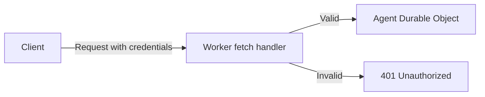

Adding authentication to your Agents ensures that only authorized users can connect to and interact with your Agent instances. There are several approaches depending on the complexity of your application.

## Choose an approach

| Approach                                                                  | Best for                                                              | Complexity  |
| ------------------------------------------------------------------------- | --------------------------------------------------------------------- | ----------- |
| [Token and middleware auth](/agents/authentication/token-and-middleware/) | Token validation, API keys, JWT verification, or framework middleware | Low–Medium  |
| [Workers OAuth Provider](/agents/authentication/oauth-provider/)          | OAuth 2.1 flows, third-party identity providers, MCP servers          | Medium–High |
| [Full-stack auth (Better Auth)](/agents/authentication/better-auth/)      | Complete user management with sign-up, sign-in, sessions, and JWT     | High        |

:::note

This section covers authentication for Agents apps in general (HTTP and WebSocket). For MCP-specific OAuth authorization, refer to [MCP Authorization](/agents/model-context-protocol/authorization/).

:::

## Core principle

All approaches follow the same principle: **authenticate the request in your Worker before it reaches the Agent**. The Agent itself should not need to handle authentication logic.

Your Worker's `fetch` handler acts as a gatekeeper. Whether you validate a static token, verify a JWT, run framework middleware, or check an OAuth access token, the check always happens before the request is forwarded to the Agent's Durable Object.

## Best practices

- **Authenticate before the Agent.** Handle authentication in your Worker's `fetch` handler or middleware, not inside the Agent's `onConnect` or `onRequest` methods. This prevents unauthenticated requests from reaching the Durable Object.
- **Use short-lived tokens for WebSockets.** WebSocket upgrade requests cannot include custom headers. Pass tokens as query parameters, and keep them short-lived (minutes, not hours) to limit exposure.
- **Name Agents by user identity.** Use the authenticated user's ID as the Agent instance name. This ensures each user gets their own Agent and makes routing deterministic. See [Instance naming patterns](/agents/api-reference/routing/#instance-naming-patterns) for more.
- **Handle token expiration on the client.** Check for expired tokens when a WebSocket disconnects. If the token is expired, redirect the user to sign in again rather than attempting to reconnect.
- **Return consistent error responses.** Always return a `401 Unauthorized` with a JSON body for invalid credentials. This makes it easier for clients to detect and handle auth failures programmatically.

## Related resources

- [Routing](/agents/api-reference/routing/) — `routeAgentRequest` and `getAgentByName` API reference
- [MCP Authorization](/agents/model-context-protocol/authorization/) — OAuth 2.1 authorization for MCP servers
- [Workers OAuth Provider](https://github.com/cloudflare/workers-oauth-provider) — OAuth 2.1 provider library for Workers
- [Better Auth](https://www.better-auth.com/) — Full-stack authentication library
- [Auth Agent example](https://github.com/cloudflare/agents/tree/main/examples/auth-agent) — Complete working example with Better Auth
