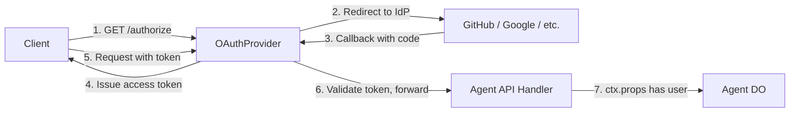

import { TypeScriptExample, WranglerConfig } from "~/components";

The [`@cloudflare/workers-oauth-provider`](https://github.com/cloudflare/workers-oauth-provider) library implements a full [OAuth 2.1](https://datatracker.ietf.org/doc/html/draft-ietf-oauth-v2-1-12) authorization server as a Cloudflare Worker. It handles token issuance, refresh, revocation, dynamic client registration, and serves the standard OAuth metadata endpoints — all running at the edge.

This approach is ideal when:

- Your Agent is accessed by third-party clients (for example, MCP clients, API consumers).
- You want to use a standard OAuth flow to authenticate users via GitHub, Google, or another identity provider.
- You need fine-grained token scoping and revocation.
- You need to comply with the OAuth 2.1 specification.

## How it works

The `OAuthProvider` wraps your Worker and intercepts OAuth-related requests. Non-OAuth requests (your API traffic) are forwarded to your handler with the authenticated user's identity available on `ctx.props`.



The library splits your Worker into two handlers:

| Handler          | Purpose                                                                                                                                            |
| ---------------- | -------------------------------------------------------------------------------------------------------------------------------------------------- |
| `apiHandler`     | Receives authenticated API requests. The user's identity and scopes are available on `this.ctx.props`. Use this to forward requests to your Agent. |
| `defaultHandler` | Receives all non-API requests — login pages, consent screens, OAuth callbacks from upstream identity providers.                                    |

## Set up the KV namespace

The library stores OAuth clients, authorization grants, and tokens in a Workers KV namespace.

```sh
npx wrangler kv namespace create OAUTH_KV
```

Add the binding to your Wrangler configuration:

<WranglerConfig>

```toml
[[kv_namespaces]]
binding = "OAUTH_KV"
id = "your-kv-namespace-id"
```

</WranglerConfig>

## Install the library

```sh
npm install @cloudflare/workers-oauth-provider
```

## Implement the handlers

The following example shows the core structure. The `AgentApiHandler` forwards authenticated requests to an Agent instance, and the `AuthHandler` handles the OAuth authorization flow.

<TypeScriptExample>

```ts
import { OAuthProvider } from "@cloudflare/workers-oauth-provider";
import { WorkerEntrypoint } from "cloudflare:workers";
import { Agent, getAgentByName, type AgentNamespace } from "agents";

interface Env {
	MyAgent: AgentNamespace<MyAgent>;
	OAUTH_PROVIDER: OAuthHelpers;
	OAUTH_KV: KVNamespace;
}

// Handles authenticated API requests.
// ctx.props is populated by OAuthProvider after token validation.
class AgentApiHandler extends WorkerEntrypoint<Env> {
	async fetch(request: Request): Promise<Response> {
		const userId = this.ctx.props.userId as string;

		// Route to the user's Agent instance
		const agent = await getAgentByName(this.env.MyAgent, userId);
		return agent.fetch(request);
	}
}

// Handles login, consent, and OAuth callbacks.
class AuthHandler extends WorkerEntrypoint<Env> {
	async fetch(request: Request): Promise<Response> {
		const url = new URL(request.url);

		if (url.pathname === "/authorize") {
			// Parse the incoming OAuth authorization request
			const oauthReq = await this.env.OAUTH_PROVIDER.parseAuthRequest(request);
			const client = await this.env.OAUTH_PROVIDER.lookupClient(
				oauthReq.clientId,
			);

			// Your login UI and consent logic here...
			// After the user authenticates and consents:
			const { redirectTo } =
				await this.env.OAUTH_PROVIDER.completeAuthorization({
					request: oauthReq,
					userId: "authenticated-user-id",
					metadata: { label: "User session" },
					scope: oauthReq.scope,
					props: { userId: "authenticated-user-id" },
				});

			return Response.redirect(redirectTo);
		}

		return new Response("Not found", { status: 404 });
	}
}

// Wire everything together.
// OAuthProvider handles /oauth/token, /oauth/register, and
// /.well-known/oauth-authorization-server automatically.
export default new OAuthProvider({
	apiRoute: "/api/",
	apiHandler: AgentApiHandler,
	defaultHandler: AuthHandler,
	authorizeEndpoint: "/authorize",
	tokenEndpoint: "/oauth/token",
	clientRegistrationEndpoint: "/oauth/register",
});

export class MyAgent extends Agent<Env> {
	// Your Agent implementation — only reachable by authenticated users
}
```

</TypeScriptExample>

## OAuthProvider configuration

The `OAuthProvider` constructor accepts the following options:

| Option                       | Description                                                                                                                                                 |
| ---------------------------- | ----------------------------------------------------------------------------------------------------------------------------------------------------------- |
| `apiRoute`                   | URL prefix for authenticated API requests (for example, `"/api/"`). Requests matching this prefix are forwarded to `apiHandler` with `ctx.props` populated. |
| `apiHandler`                 | `WorkerEntrypoint` class that handles authenticated API traffic.                                                                                            |
| `defaultHandler`             | `WorkerEntrypoint` class that handles everything else (login UI, consent, callbacks).                                                                       |
| `authorizeEndpoint`          | Path for the OAuth authorization endpoint (for example, `"/authorize"`).                                                                                    |
| `tokenEndpoint`              | Path for the token exchange endpoint (for example, `"/oauth/token"`).                                                                                       |
| `clientRegistrationEndpoint` | Path for [dynamic client registration](https://datatracker.ietf.org/doc/html/rfc7591) (for example, `"/oauth/register"`).                                   |

The library also automatically serves the [OAuth Authorization Server Metadata](https://datatracker.ietf.org/doc/html/rfc8414) endpoint at `/.well-known/oauth-authorization-server`.

## Integrate with a third-party identity provider

In most real applications, the `AuthHandler` does not authenticate users directly. Instead, it redirects to an upstream identity provider (GitHub, Google, Auth0, etc.) and processes the callback.

The general flow is:

1. Client starts the OAuth flow by requesting `/authorize`.
2. `AuthHandler` redirects the user to the upstream IdP (for example, GitHub's `/login/oauth/authorize`).
3. The user authenticates with the IdP and is redirected back to your callback URL.
4. `AuthHandler` exchanges the IdP's authorization code for an access token, fetches the user's profile, and calls `completeAuthorization` with the user's identity.
5. The client receives an access token scoped to your Agent.

<TypeScriptExample>

```ts
class AuthHandler extends WorkerEntrypoint<Env> {
	async fetch(request: Request): Promise<Response> {
		const url = new URL(request.url);

		if (url.pathname === "/authorize") {
			const oauthReq = await this.env.OAUTH_PROVIDER.parseAuthRequest(request);

			// Store the OAuth request state, then redirect to GitHub
			const state = btoa(
				JSON.stringify({
					oauthReq,
				}),
			);

			const githubAuthUrl = new URL("https://github.com/login/oauth/authorize");
			githubAuthUrl.searchParams.set("client_id", this.env.GITHUB_CLIENT_ID);
			githubAuthUrl.searchParams.set("redirect_uri", `${url.origin}/callback`);
			githubAuthUrl.searchParams.set("state", state);
			githubAuthUrl.searchParams.set("scope", "read:user user:email");

			return Response.redirect(githubAuthUrl.toString());
		}

		if (url.pathname === "/callback") {
			const code = url.searchParams.get("code");
			const state = JSON.parse(atob(url.searchParams.get("state") || ""));

			// Exchange the GitHub code for an access token
			const tokenResponse = await fetch(
				"https://github.com/login/oauth/access_token",
				{
					method: "POST",
					headers: {
						"Content-Type": "application/json",
						Accept: "application/json",
					},
					body: JSON.stringify({
						client_id: this.env.GITHUB_CLIENT_ID,
						client_secret: this.env.GITHUB_CLIENT_SECRET,
						code,
					}),
				},
			);
			const { access_token } = await tokenResponse.json<{
				access_token: string;
			}>();

			// Fetch the user's GitHub profile
			const userResponse = await fetch("https://api.github.com/user", {
				headers: {
					Authorization: `Bearer ${access_token}`,
					"User-Agent": "cloudflare-agent",
				},
			});
			const user = await userResponse.json<{ id: number; login: string }>();

			// Complete the OAuth flow — issue a token to the client
			const { redirectTo } =
				await this.env.OAUTH_PROVIDER.completeAuthorization({
					request: state.oauthReq,
					userId: String(user.id),
					metadata: { label: `GitHub: ${user.login}` },
					scope: state.oauthReq.scope,
					props: {
						userId: String(user.id),
						username: user.login,
					},
				});

			return Response.redirect(redirectTo);
		}

		return new Response("Not found", { status: 404 });
	}
}
```

</TypeScriptExample>

Store the GitHub OAuth credentials as [Workers secrets](/workers/configuration/secrets/):

```sh
npx wrangler secret put GITHUB_CLIENT_ID
npx wrangler secret put GITHUB_CLIENT_SECRET
```

## Token scoping and revocation

The `completeAuthorization` call accepts a `scope` parameter that controls what the issued token can access. You can check scopes in your `AgentApiHandler` via `this.ctx.props`:

<TypeScriptExample>

```ts
class AgentApiHandler extends WorkerEntrypoint<Env> {
	async fetch(request: Request): Promise<Response> {
		const scopes = (this.ctx.props.scope as string[]) || [];

		// Check for required scope before forwarding to the Agent
		if (!scopes.includes("agent:write")) {
			return Response.json({ error: "Insufficient scope" }, { status: 403 });
		}

		const userId = this.ctx.props.userId as string;
		const agent = await getAgentByName(this.env.MyAgent, userId);
		return agent.fetch(request);
	}
}
```

</TypeScriptExample>

Token revocation is handled automatically by the library at the token endpoint. Clients can revoke tokens by sending a `POST` request to your token endpoint with `token_type_hint=access_token`.

## Next steps

- For a complete walkthrough of OAuth with MCP servers, see the [MCP Authorization guide](/agents/model-context-protocol/authorization/).
- For integration with specific providers (Auth0, Stytch, WorkOS), see the [`workers-oauth-provider` examples](https://github.com/cloudflare/workers-oauth-provider).
- For complete user management with sign-up/sign-in flows, see [Full-stack auth with Better Auth](/agents/authentication/better-auth/).
