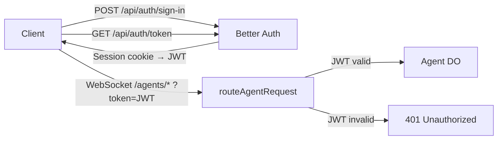

import { TypeScriptExample, WranglerConfig } from "~/components";

Adding authentication to your Agents ensures that only authorized users can connect to and interact with your Agent instances. This guide covers multiple approaches, from simple token validation to full user management with OAuth.

:::note

This guide covers authentication for Agents apps in general (HTTP and WebSocket). For MCP-specific OAuth authorization, refer to [MCP Authorization](/agents/model-context-protocol/authorization/).

:::

## Overview

There are several ways to add authentication to your Agents, depending on the complexity of your application:

| Approach | Best for | Complexity |
| --- | --- | --- |
| [Auth hooks with `routeAgentRequest`](#auth-hooks-with-routeagentrequest) | Simple token or API key validation | Low |
| [Custom routing with `getAgentByName`](#custom-routing-with-getagentbyname) | Full control over routing with framework middleware | Medium |
| [Workers OAuth Provider](#workers-oauth-provider) | OAuth 2.1 flows, third-party identity providers, MCP servers | Medium-High |
| [Full-stack auth (Better Auth)](#full-stack-auth-with-better-auth) | Complete user management with sign-up, sign-in, sessions, and JWT | High |

All approaches follow the same principle: **authenticate the request in your Worker before it reaches the Agent**. The Agent itself should not need to handle authentication logic.

The examples below assume you have already [configured your Agent's Durable Object binding](/agents/getting-started/testing-your-agent/#add-the-agent-configuration) in your Wrangler configuration.

## Auth hooks with `routeAgentRequest`

The simplest way to add authentication is through the `onBeforeConnect` and `onBeforeRequest` hooks provided by [`routeAgentRequest`](/agents/api-reference/calling-agents/). These hooks run before a request is forwarded to an Agent, letting you validate credentials and reject unauthorized requests.

- `onBeforeConnect` runs before a WebSocket upgrade request reaches the Agent.
- `onBeforeRequest` runs before an HTTP request reaches the Agent.

Both hooks follow the same pattern:
- Return a `Request` (or `void`) to continue to the Agent.
- Return a `Response` to short-circuit and reject the request (for example, a `401 Unauthorized`).

Both hooks also receive a second argument `{ party, name }` containing the resolved Agent class name and instance name from the URL. You can use this to make per-instance authorization decisions (for example, restricting which Agents a user can access).

### Validate a static token

The following example checks for a known token on both WebSocket and HTTP requests. In production, store tokens as [Workers secrets](/workers/configuration/secrets/) rather than hardcoding them.

<TypeScriptExample>

```ts
import { Agent, routeAgentRequest } from "agents";

function authenticate(request: Request): Request | Response {
  const url = new URL(request.url);
  // Check query param (?token=...) or Authorization header
  const token =
    url.searchParams.get("token") ||
    request.headers.get("Authorization")?.replace("Bearer ", "");

  if (token === "my-secret-token") {
    return request; // Valid — continue to the Agent
  }
  return Response.json({ error: "Unauthorized" }, { status: 401 });
}

export default {
  async fetch(request: Request, env: Env): Promise<Response> {
    return (
      (await routeAgentRequest(request, env, {
        onBeforeConnect: async (req) => authenticate(req),
        onBeforeRequest: async (req) => authenticate(req),
      })) || new Response("Not found", { status: 404 })
    );
  },
} satisfies ExportedHandler<Env>;

export class MyAgent extends Agent<Env> {
  // Agent code here -- only reached by authenticated requests
}
```

</TypeScriptExample>

### Validate a JWT

For production applications, validate a JSON Web Token (JWT) instead of a static token. This example uses the [`jose`](https://github.com/panva/jose) library:

<TypeScriptExample>

```ts
import { Agent, routeAgentRequest } from "agents";
import { jwtVerify, createRemoteJWKSet } from "jose";

// Fetch public keys from your identity provider's JWKS endpoint
const jwks = createRemoteJWKSet(
  new URL("https://your-idp.example.com/.well-known/jwks.json")
);

async function verifyJwt(token: string) {
  try {
    const { payload } = await jwtVerify(token, jwks, {
      issuer: "https://your-idp.example.com",
      audience: "your-app-id",
    });
    return payload;
  } catch {
    return null;
  }
}

export default {
  async fetch(request: Request, env: Env): Promise<Response> {
    return (
      (await routeAgentRequest(request, env, {
        onBeforeConnect: async (req) => {
          // WebSocket clients pass the token as a query parameter,
          // since WebSocket upgrade requests cannot set custom headers.
          const token = new URL(req.url).searchParams.get("token");
          if (!token) {
            return Response.json(
              { error: "Missing token" },
              { status: 401 }
            );
          }
          const payload = await verifyJwt(token);
          if (!payload) {
            return Response.json(
              { error: "Invalid token" },
              { status: 401 }
            );
          }
          return req;
        },
        onBeforeRequest: async (req) => {
          // HTTP clients pass the token as a Bearer token in the
          // Authorization header.
          const authHeader = req.headers.get("Authorization");
          const token = authHeader?.startsWith("Bearer ")
            ? authHeader.slice(7)
            : null;
          if (!token) {
            return Response.json(
              { error: "Missing token" },
              { status: 401 }
            );
          }
          const payload = await verifyJwt(token);
          if (!payload) {
            return Response.json(
              { error: "Invalid token" },
              { status: 401 }
            );
          }
          return req;
        },
      })) || new Response("Not found", { status: 404 })
    );
  },
} satisfies ExportedHandler<Env>;
```

</TypeScriptExample>

### Pass the token from the client

When using the `useAgent` React hook, pass the token via the `query` parameter. The SDK appends these as query parameters to the WebSocket URL:

```tsx
import { useAgent } from "agents/react";

function ChatApp() {
  const agent = useAgent({
    agent: "MyAgent",
    name: "user-123",
    query: async () => ({
      token: localStorage.getItem("auth_token") || "",
    }),
  });

  // Use the agent connection...
}
```

For HTTP requests using `agentFetch` or direct `fetch`, include the token in the `Authorization` header:

```ts
const response = await fetch("/agents/my-agent/user-123", {
  headers: {
    Authorization: `Bearer ${token}`,
  },
});
```

## Custom routing with `getAgentByName`

When you need more control over routing — for example, using a framework like [Hono](https://hono.dev) with its own middleware stack — use [`getAgentByName`](/agents/api-reference/calling-agents/) to look up Agent instances after authenticating the request yourself.

This approach is useful when:
- You want to use your framework's middleware ecosystem for auth.
- You need to derive the Agent instance name from the authenticated user (for example, one Agent per user).
- You have non-Agent routes in the same Worker that also need auth.

<TypeScriptExample>

```ts
import { Agent, getAgentByName, type AgentNamespace } from "agents";
import { Hono } from "hono";
import { bearerAuth } from "hono/bearer-auth";

interface Env {
  MyAgent: AgentNamespace<MyAgent>;
  AUTH_TOKEN: string;
}

const app = new Hono<{ Bindings: Env }>();

// Apply auth middleware to all agent routes
app.use("/agent/*", bearerAuth({ token: "my-secret-token" }));

// Route authenticated requests to an Agent named by user ID
app.all("/agent/:userId/*", async (c) => {
  const userId = c.req.param("userId");
  const agent = await getAgentByName<Env, MyAgent>(
    c.env.MyAgent,
    userId
  );
  return agent.fetch(c.req.raw);
});

// You can also call Agent methods directly via RPC
app.post("/agent/:userId/summarize", async (c) => {
  const userId = c.req.param("userId");
  const agent = await getAgentByName<Env, MyAgent>(
    c.env.MyAgent,
    userId
  );
  const summary = await agent.summarize();
  return c.json({ summary });
});

export default app;

export class MyAgent extends Agent<Env> {
  async summarize() {
    return "Here is a summary of your data.";
  }
}
```

</TypeScriptExample>

Since `getAgentByName` returns a Durable Object stub, you can also call [methods directly on the Agent via RPC](/agents/api-reference/calling-agents/#calling-methods-on-agents), without going through HTTP.

### Use with Hono Agents middleware

The [`hono-agents`](https://www.npmjs.com/package/hono-agents) package provides an `agentsMiddleware()` that wraps `routeAgentRequest` as Hono middleware. You can combine it with Hono's auth middleware:

```ts
import { Hono } from "hono";
import { bearerAuth } from "hono/bearer-auth";
import { agentsMiddleware } from "hono-agents";

const app = new Hono();

// Auth first, then route to agents
app.use("/agents/*", bearerAuth({ token: "my-secret-token" }));
app.use("/agents/*", agentsMiddleware());

export default app;
```

## Workers OAuth Provider

The [`@cloudflare/workers-oauth-provider`](https://github.com/cloudflare/workers-oauth-provider) library implements a full OAuth 2.1 authorization server as a Cloudflare Worker. It handles token issuance, refresh, revocation, dynamic client registration, and serves the standard OAuth metadata endpoints.

This approach is ideal when:
- Your Agent is accessed by third-party clients (for example, MCP clients, API consumers).
- You want to use a standard OAuth flow to authenticate users via GitHub, Google, or another identity provider.
- You need fine-grained token scoping and revocation.

The `OAuthProvider` acts as middleware wrapping your Worker. It intercepts OAuth-related requests (token exchange, metadata endpoints) and forwards authenticated API requests to your handler with the user's identity available on `ctx.props`.

<TypeScriptExample>

```ts
import { OAuthProvider } from "@cloudflare/workers-oauth-provider";
import { WorkerEntrypoint } from "cloudflare:workers";
import { Agent, getAgentByName, type AgentNamespace } from "agents";

interface Env {
  MyAgent: AgentNamespace<MyAgent>;
  OAUTH_PROVIDER: OAuthHelpers;
  OAUTH_KV: KVNamespace;
}

// Handles authenticated API requests — ctx.props contains the user identity
class AgentApiHandler extends WorkerEntrypoint<Env> {
  async fetch(request: Request): Promise<Response> {
    // ctx.props is populated by OAuthProvider after token validation
    const userId = this.ctx.props.userId as string;
    const agent = await getAgentByName(this.env.MyAgent, userId);
    return agent.fetch(request);
  }
}

// Handles the login/authorization UI and any non-API routes
class AuthHandler extends WorkerEntrypoint<Env> {
  async fetch(request: Request): Promise<Response> {
    const url = new URL(request.url);

    if (url.pathname === "/authorize") {
      // Parse the OAuth authorization request
      const oauthReq = await this.env.OAUTH_PROVIDER.parseAuthRequest(request);
      const client = await this.env.OAUTH_PROVIDER.lookupClient(
        oauthReq.clientId
      );

      // Your login UI and consent logic here...
      // After the user authenticates and consents:
      const { redirectTo } = await this.env.OAUTH_PROVIDER.completeAuthorization({
        request: oauthReq,
        userId: "authenticated-user-id",
        metadata: { label: "User session" },
        scope: oauthReq.scope,
        props: { userId: "authenticated-user-id" },
      });

      return Response.redirect(redirectTo);
    }

    return new Response("Not found", { status: 404 });
  }
}

export default new OAuthProvider({
  apiRoute: "/api/",
  apiHandler: AgentApiHandler,
  defaultHandler: AuthHandler,
  authorizeEndpoint: "/authorize",
  tokenEndpoint: "/oauth/token",
  clientRegistrationEndpoint: "/oauth/register",
});

export class MyAgent extends Agent<Env> {
  // Your Agent implementation
}
```

</TypeScriptExample>

The library requires a Workers KV namespace bound as `OAUTH_KV` for storing clients, grants, and tokens.

<WranglerConfig>

```toml
[[kv_namespaces]]
binding = "OAUTH_KV"
id = "your-kv-namespace-id"
```

</WranglerConfig>

For more details on integrating OAuth with third-party providers (GitHub, Google, Auth0, Stytch, WorkOS), see the [MCP Authorization guide](/agents/model-context-protocol/authorization/) and the [`workers-oauth-provider` documentation](https://github.com/cloudflare/workers-oauth-provider).

## Full-stack auth with Better Auth

For applications that need complete user management — sign-up, sign-in, email/password, sessions, and JWTs — you can use a library like [Better Auth](https://www.better-auth.com/) alongside the Agents SDK. This approach gives you a full authentication system running entirely on Cloudflare, using D1 as the user database.

You can view the full example code on [GitHub](https://github.com/cloudflare/agents/tree/main/examples/auth-agent).

### How it works

The architecture splits requests across three paths in your Worker's `fetch` handler:

1. **`/api/auth/*`** — Handled by Better Auth (sign-up, sign-in, JWT issuance, JWKS).
2. **`/agents/*`** — Handled by `routeAgentRequest` with JWT validation in the `onBeforeConnect` and `onBeforeRequest` hooks.
3. **`/*`** — Your frontend (SPA or static assets).



### Set up the server

Install dependencies:

```sh
npm install better-auth jose kysely-d1
```

Configure Better Auth with D1 and the JWT plugin:

<TypeScriptExample>

```ts
// src/auth.ts
import { betterAuth } from "better-auth";
import { bearer, jwt } from "better-auth/plugins";
import { D1Dialect } from "kysely-d1";
import { createLocalJWKSet, jwtVerify, type JWTPayload } from "jose";
import { env } from "cloudflare:workers";

// Lazy singleton — betterAuth() must be called inside a request context
// on Workers, not at module scope.
let _auth: ReturnType<typeof betterAuth>;
export function getAuth() {
  return (_auth ??= betterAuth({
    database: {
      dialect: new D1Dialect({ database: env.AUTH_DB }),
      type: "sqlite",
    },
    emailAndPassword: { enabled: true },
    secret: env.BETTER_AUTH_SECRET,
    baseURL: env.BETTER_AUTH_URL,
    plugins: [bearer(), jwt()],
  }));
}

// Verify a JWT by reading JWKS directly from D1.
// Uses createLocalJWKSet instead of createRemoteJWKSet because the
// JWKS endpoint is on this same Worker — same-zone subrequests bypass
// Workers and hit the origin, which does not serve JWKS.
export async function verifyToken(
  token: string
): Promise<JWTPayload | null> {
  try {
    const result = await env.AUTH_DB.prepare(
      "SELECT id, publicKey FROM jwks"
    ).all<{ id: string; publicKey: string }>();

    if (!result.results?.length) return null;

    const jwks = createLocalJWKSet({
      keys: result.results.map((row) => ({
        ...JSON.parse(row.publicKey),
        kid: row.id,
      })),
    });

    const { payload } = await jwtVerify(token, jwks);
    return payload;
  } catch {
    return null;
  }
}
```

</TypeScriptExample>

Wire it into your Worker's `fetch` handler alongside `routeAgentRequest`:

<TypeScriptExample>

```ts
// src/server.ts
import { AIChatAgent } from "@cloudflare/ai-chat";
import { routeAgentRequest } from "agents";
import { getAuth, verifyToken } from "./auth";

export class SecuredChatAgent extends AIChatAgent<Env> {
  // Your agent logic here — only reachable by authenticated users
}

export default {
  async fetch(request: Request, env: Env): Promise<Response> {
    const url = new URL(request.url);

    // Auth routes — sign-up, sign-in, token issuance, JWKS
    if (url.pathname.startsWith("/api/auth")) {
      return getAuth().handler(request);
    }

    // Agent routes — protected by JWT validation
    if (url.pathname.startsWith("/agents")) {
      const response = await routeAgentRequest(request, env, {
        onBeforeConnect: async (req) => {
          const token = new URL(req.url).searchParams.get("token");
          if (!token)
            return Response.json({ error: "Missing token" }, { status: 401 });
          const payload = await verifyToken(token);
          if (!payload)
            return Response.json({ error: "Unauthorized" }, { status: 401 });
          return req;
        },
        onBeforeRequest: async (req) => {
          const authHeader = req.headers.get("Authorization");
          const token = authHeader?.startsWith("Bearer ")
            ? authHeader.slice(7)
            : null;
          if (!token)
            return Response.json({ error: "Missing token" }, { status: 401 });
          const payload = await verifyToken(token);
          if (!payload)
            return Response.json({ error: "Unauthorized" }, { status: 401 });
          return req;
        },
      });
      if (response) return response;
      return new Response("Agent not found", { status: 404 });
    }

    return new Response("Not found", { status: 404 });
  },
} satisfies ExportedHandler<Env>;
```

</TypeScriptExample>

### Set up the database

Better Auth needs a D1 database. Create it and run the schema setup:

```sh
npx wrangler d1 create auth-db
```

Add the binding to your Wrangler config:

<WranglerConfig>

```toml
[[d1_databases]]
binding = "AUTH_DB"
database_name = "auth-db"
database_id = "your-database-id"
```

</WranglerConfig>

Create the required tables (Better Auth uses `user`, `session`, `account`, and `jwks` tables):

```sql
-- db/setup.sql
CREATE TABLE IF NOT EXISTS "user" (
  "id" TEXT PRIMARY KEY NOT NULL,
  "name" TEXT NOT NULL,
  "email" TEXT NOT NULL UNIQUE,
  "emailVerified" INTEGER NOT NULL DEFAULT 0,
  "image" TEXT,
  "createdAt" TEXT NOT NULL,
  "updatedAt" TEXT NOT NULL
);

CREATE TABLE IF NOT EXISTS "session" (
  "id" TEXT PRIMARY KEY NOT NULL,
  "expiresAt" TEXT NOT NULL,
  "token" TEXT NOT NULL UNIQUE,
  "createdAt" TEXT NOT NULL,
  "updatedAt" TEXT NOT NULL,
  "ipAddress" TEXT,
  "userAgent" TEXT,
  "userId" TEXT NOT NULL REFERENCES "user"("id")
);

CREATE TABLE IF NOT EXISTS "account" (
  "id" TEXT PRIMARY KEY NOT NULL,
  "accountId" TEXT NOT NULL,
  "providerId" TEXT NOT NULL,
  "userId" TEXT NOT NULL REFERENCES "user"("id"),
  "accessToken" TEXT,
  "refreshToken" TEXT,
  "idToken" TEXT,
  "accessTokenExpiresAt" TEXT,
  "refreshTokenExpiresAt" TEXT,
  "scope" TEXT,
  "password" TEXT,
  "createdAt" TEXT NOT NULL,
  "updatedAt" TEXT NOT NULL
);

CREATE TABLE IF NOT EXISTS "jwks" (
  "id" TEXT PRIMARY KEY NOT NULL,
  "publicKey" TEXT NOT NULL,
  "privateKey" TEXT NOT NULL,
  "createdAt" TEXT NOT NULL
);
```

Apply the schema:

```sh
npx wrangler d1 execute auth-db --local --file=db/setup.sql
```

Set the secret for local development:

```sh
echo 'BETTER_AUTH_SECRET="your-secret-key-here"' >> .dev.vars
```

### Set up the client

On the client, use Better Auth's React client to manage sign-in state, and pass JWTs to the Agent via the `useAgent` hook:

```tsx
// src/auth-client.ts
import { createAuthClient } from "better-auth/react";
import { jwtClient } from "better-auth/client/plugins";

export const authClient = createAuthClient({
  plugins: [jwtClient()],
});

// After sign-in, fetch a JWT and store it for WebSocket auth
export async function fetchAndStoreJwt(): Promise<string | null> {
  const result = await authClient.token();
  if (result.data?.token) {
    localStorage.setItem("jwt_token", result.data.token);
    return result.data.token;
  }
  return null;
}
```

```tsx
// src/client.tsx
import { useAgent } from "agents/react";
import { fetchAndStoreJwt } from "./auth-client";

function ChatView() {
  const agent = useAgent({
    agent: "SecuredChatAgent",
    name: "default",
    // The query function provides params appended to the WebSocket URL
    query: async () => ({
      token: localStorage.getItem("jwt_token") || "",
    }),
  });

  // Use agent for chat, state sync, etc.
}
```

The authentication flow is:

1. User signs in via Better Auth (session cookie set automatically).
2. Client calls `authClient.token()` to get a short-lived JWT (authenticated via the session cookie).
3. JWT is stored in `localStorage` and passed as `?token=` on WebSocket connections.
4. The `onBeforeConnect` hook on the server verifies the JWT before the connection reaches the Agent.

:::note[JWKS verification on Workers]

When both Better Auth and your Agent run on the same Worker, use `createLocalJWKSet` from `jose` to verify JWTs by reading keys directly from D1. Using `createRemoteJWKSet` to fetch from your own Worker's `/api/auth/jwks` endpoint will fail because same-zone subrequests bypass Workers on Cloudflare.

:::

## Best practices

- **Authenticate before the Agent.** Handle authentication in your Worker's `fetch` handler or middleware, not inside the Agent's `onConnect` or `onRequest` methods. This prevents unauthenticated requests from reaching the Durable Object.
- **Use short-lived tokens for WebSockets.** WebSocket upgrade requests cannot include custom headers. Pass tokens as query parameters, and keep them short-lived (minutes, not hours) to limit exposure.
- **Name Agents by user identity.** Use the authenticated user's ID as the Agent instance name. This ensures each user gets their own Agent and makes routing deterministic. See [Naming your Agents](/agents/api-reference/calling-agents/#naming-your-agents) for more.
- **Handle token expiration on the client.** Check for expired tokens when a WebSocket disconnects. If the token is expired, redirect the user to sign in again rather than attempting to reconnect.

## Related resources

- [Calling Agents](/agents/api-reference/calling-agents/) — `routeAgentRequest` and `getAgentByName` API reference
- [MCP Authorization](/agents/model-context-protocol/authorization/) — OAuth 2.1 authorization for MCP servers
- [Workers OAuth Provider](https://github.com/cloudflare/workers-oauth-provider) — OAuth 2.1 provider library for Workers
- [Better Auth](https://www.better-auth.com/) — Full-stack authentication library
- [Auth Agent example](https://github.com/cloudflare/agents/tree/main/examples/auth-agent) — Complete working example with Better Auth
